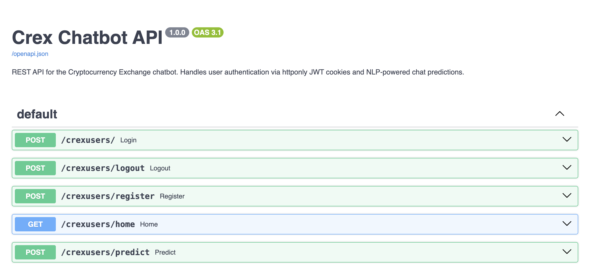

# Chatbot in Python

Conversational agent for a simulated Cryptocurrency Exchange, built with FastAPI, React, and sentence-transformers.

## Architecture

```
React client (Vite + shadcn/ui)  :3000
    ↓  POST /crexusers/predict  { message }
FastAPI backend  (main.py)       :5000
    ↓  communicate(text, id, name)
Chatbot engine  (chatbot.py → utils.py)
    ↓  SQLAlchemy ORM
SQLite database  (db.py)
```

## Tech Stack

| Layer | Technology |
|---|---|
| Backend | Python 3.11, FastAPI, Uvicorn |
| NLP/ML | sentence-transformers (`all-MiniLM-L6-v2`) |
| Database | SQLite via SQLAlchemy + Alembic |
| Auth | JWT (httponly cookies), bcrypt |
| Frontend | React 18, Vite, TypeScript, shadcn/ui, Tailwind CSS |
| Container | Docker, nginx |

## API Docs

Interactive Swagger UI is available when the backend is running:

- **Local:** http://localhost:5000/docs
- **Docker:** http://localhost:5001/docs



## Run with Docker

```bash
cp .env.example .env
# Set SECRET_KEY to a long random string in .env

docker-compose up --build
```

- Frontend: http://localhost:3000
- API docs: http://localhost:5001/docs

## Run Locally

**Backend**

```bash
python3 -m venv venv && . venv/bin/activate
pip install -r requirements.txt
uvicorn main:app --port 5000
```

**Frontend**

```bash
cd client
npm install
npm run dev   # http://localhost:3000
```

## Default Login

```
Username: daniel
Password: pass1
```

## Example


