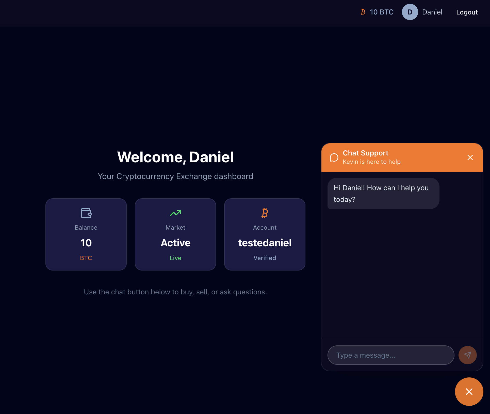

# Chatbot in Python

Conversational agent using Python, Flask and Javascript

## Architecture

The application consists of three layers: a Flask web backend, an NLP/ML chatbot engine, and a MySQL database.

```
Browser (JavaScript chatbox)
    ↓  POST /crexusers/predict  { message }
Flask app  (app.py)
    ↓  communicate(text, id, name)
Chatbot engine  (chatbot.py → utils.py)
    ↓  SQL queries
MySQL database  (db.py)
```

### ML Pipeline

The chatbot uses **semantic intent classification** via sentence-transformers:

**Pre-computation** (run once with `python train.py`):
1. Load intent patterns from `intents.json`
2. Encode all patterns with `all-MiniLM-L6-v2` (384-dim embeddings)
3. Compute mean embedding per intent; save to `intent_embeddings.pkl`

**Inference** (every user message):
1. Load cached embeddings at startup (once, not per request)
2. Encode user input with the same model
3. Compute cosine similarity against all intent embeddings
4. Return best match if score ≥ 0.35, else ask for clarification
5. Apply template substitutions (`%%Name%%`, `%%TIME%%`) and handle special intents (Buy/Sell update the user's BTC balance in MySQL)

### Tech Stack

| Layer | Technology |
|---|---|
| Backend | Python, Flask, Flask-MySQLdb |
| NLP/ML | sentence-transformers (`all-MiniLM-L6-v2`) |
| Database | MySQL |
| Frontend | Vanilla JS, HTML/CSS |

### Database Schema

```sql
accounts (id, username, name, password, email, balance)
```

Passwords are hashed with bcrypt. `balance` holds the user's simulated BTC units.

## Setup

1. Clone this repository and create a virtual environment

```bash
$ git clone
$ cd chatbot-python
$ python3 -m venv venv
$ . venv/bin/activate
```

2. Install dependencies and packages

```bash
$ (venv) pip install -r requirements.txt
```

## Run

1. Pre-compute intent embeddings

```bash
$ (venv) python3 train.py
```

2. Run the app

```bash
$ (venv) python3 app.py
```

3. Go to website

http://localhost:5000/crexusers/

4. Login using one of the users

Username: daniel
Password: pass1

5. Test the chatbot

## Docker

```bash
cp .env.example .env
# Edit .env: set SECRET_KEY and MYSQL_PASSWORD

docker-compose up --build
```

App available at http://localhost:5000/crexusers/

## Example



## Roadmap

[x] ~~Create simple intents file to categorize sentences~~ \
[x] ~~Build Neural Network to train the chatbot~~ \
[x] ~~Use Lemmatization and convert data in numerical values~~ \
[x] ~~Ability to check for client info~~ \
[x] ~~Answer and complete orders from users~~ \
[ ] Add other AI features
