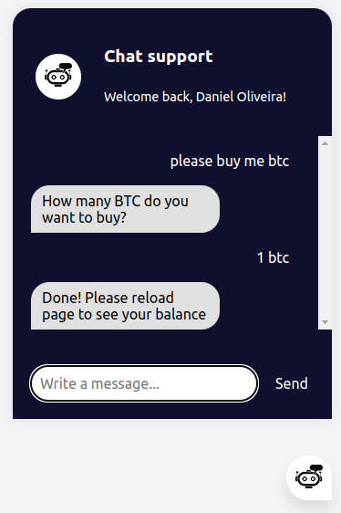

# Chatbot in Python

Conversational agent using Python, Flask and Javascript

## Setup

1. Clone this repository and create a virtual environment

```bash
$ git clone
$ cd si2_mp
$ python3 -m venv venv
$ . venv/bin/activate
```

2. Install dependencies and packages

```bash
$ (venv) pip install -r requirements
$ (venv) python3

> > > import nltk
> > > nltk.download('punkt')
> > > nltk.download('punkt_tab')
> > > nltk.download('wordnet')

```

## Run

1. Train the chatbot

```bash
$ (venv) python3 train.py
```

2. Run the app

```bash
$ (venv) python3 app.py
```

3. Go to website

http://localhost:5000/crexusers/

4. Login using one of the users

Username: daniel
Password: pass1

5. Test the chatbot

## Example



## Roadmap

[x] ~~Create simple intents file to categorize sentences~~ \
[x] ~~Build Neural Network to train the chatbot~~ \
[x] ~~Use Lemmatization and convert data in numerical values~~ \
[x] ~~Ability to check for client info~~ \
[x] ~~Answer and complete orders from users~~ \
[ ] Add other AI features
